## การเลือกใช้ map style

ในการเลือกใช้ style ของ map ให้กำหนด parameter style ในตอนสร้าง URL ไปยัง MapStyle แล้วใส่ชื่อ style ที่ต้องการ

```javascript
https://api-maps.thinknet.co.th/v2/maps-styles/{ชื่อ style}

```
## รายชื่อ Map Styles
- [almond](#almond)
- [cha-thai](#cha-thai)
- [charcoal](#charcoal)
- [cloudy](#cloudy)
- [hybrid](#hybrid)
- [ivory](#ivory)
- [lightsteel](#lightsteel)
- [midnight](#midnight)
- [satellite](#satellite)
- [spearmint](#spearmint)
- [terrain](#terrain)

## ตัวอย่าง Map Style

### almond
```javascript
https://api-maps.thinknet.co.th/v2/maps-styles/almond?app_id=<YOUR_APP_ID>&api_key=<YOUR_API_KEY>

```
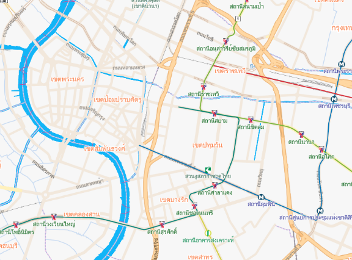

### cha-thai
```javascript
https://api-maps.thinknet.co.th/v2/maps-styles/cha-thai?app_id=<YOUR_APP_ID>&api_key=<YOUR_API_KEY>

```
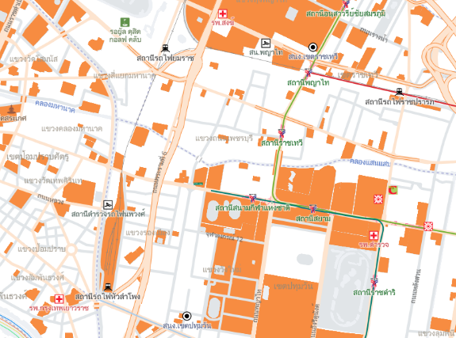

### charcoal
```javascript
https://api-maps.thinknet.co.th/v2/maps-styles/charcoal?app_id=<YOUR_APP_ID>&api_key=<YOUR_API_KEY>

```
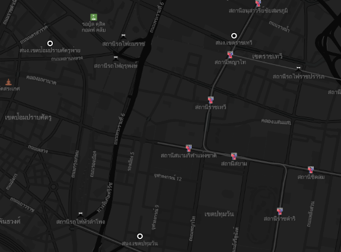

### cloudy
```javascript
https://api-maps.thinknet.co.th/v2/maps-styles/cloudy?app_id=<YOUR_APP_ID>&api_key=<YOUR_API_KEY>

```
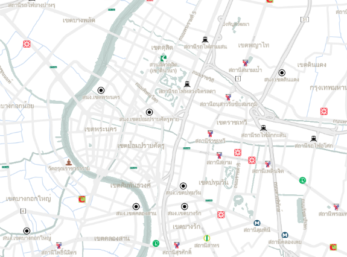

### hybrid
```javascript
https://api-maps.thinknet.co.th/v2/maps-styles/hybrid?app_id=<YOUR_APP_ID>&api_key=<YOUR_API_KEY>

```
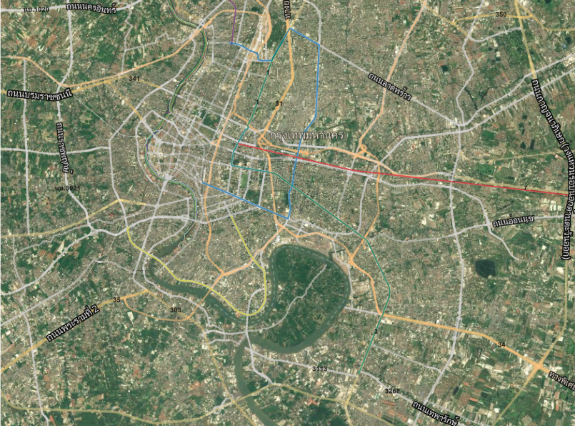

### ivory
```javascript
https://api-maps.thinknet.co.th/v2/maps-styles/ivory?app_id=<YOUR_APP_ID>&api_key=<YOUR_API_KEY>

```
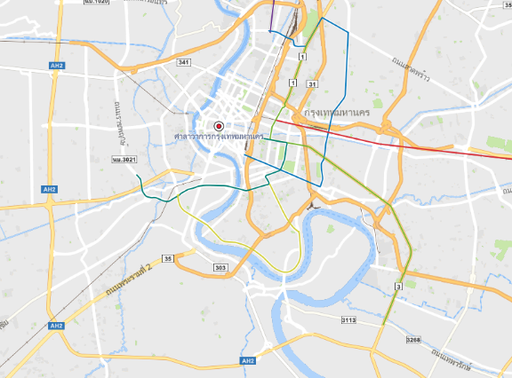

### lightsteel
```javascript
https://api-maps.thinknet.co.th/v2/maps-styles/lightsteel?app_id=<YOUR_APP_ID>&api_key=<YOUR_API_KEY>

```
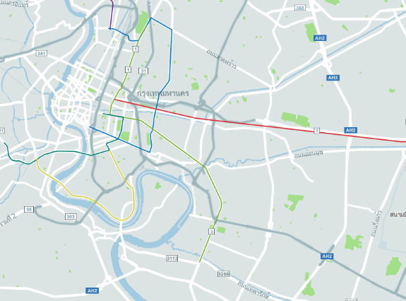

### midnight
```javascript
https://api-maps.thinknet.co.th/v2/maps-styles/midnight?app_id=<YOUR_APP_ID>&api_key=<YOUR_API_KEY>

```
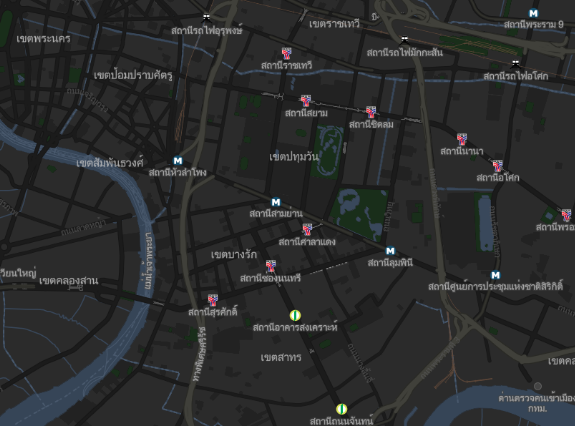

### satellite
```javascript
https://api-maps.thinknet.co.th/v2/maps-styles/satellite?app_id=<YOUR_APP_ID>&api_key=<YOUR_API_KEY>

```
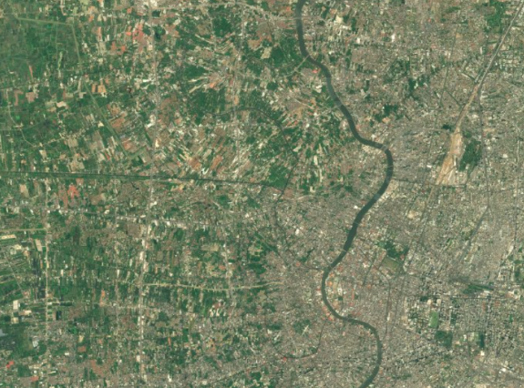

### spearmint
```javascript
https://api-maps.thinknet.co.th/v2/maps-styles/spearmint?app_id=<YOUR_APP_ID>&api_key=<YOUR_API_KEY>

```
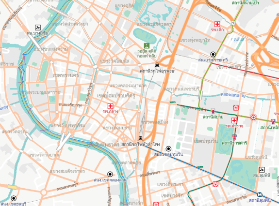

### terrain
```javascript
https://api-maps.thinknet.co.th/v2/maps-styles/terrain?app_id=<YOUR_APP_ID>&api_key=<YOUR_API_KEY>

```
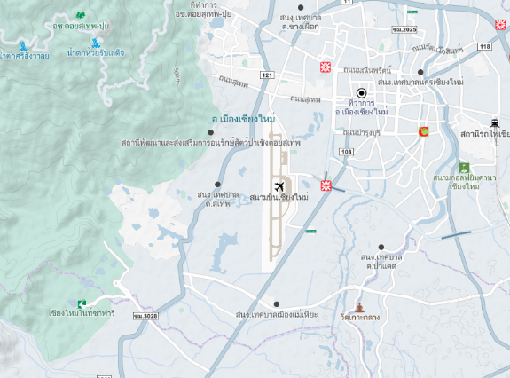

## การกำหนดการแสดงภาษาบนแผนที่

ในการกำหนดการแสดงภาษาบนแผนที่ ให้กำหนด parameter lang ในตอนสร้าง URL ไปยัง MapStyle แล้วใส่อักษรย่อ ภาษา ที่ต้องการ ซึ่งในตอนนี้ map style รองรับภาษา ไทย อังกฤษ และ ไทย-อังกฤษ

| ภาษา | key ที่ใช้ |
|------|---------|
|  ไทย (default)|  th |
| อังกฤษ |  en |
| ไทย-อังกฤษ |  th-en |

### ตัวอย่าง การเรียกใช้ภาษา ไทย-อังกฤษ
```javascript
https://api-maps.thinknet.co.th/v2/maps-styles/ivory?app_id=<YOUR_APP_ID>&api_key=<YOUR_API_KEY>&lang=th-en

```
### การแสดงผล

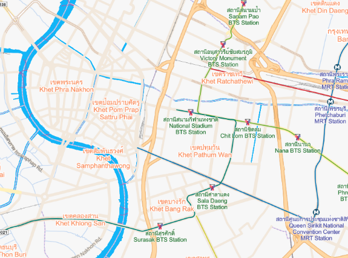
